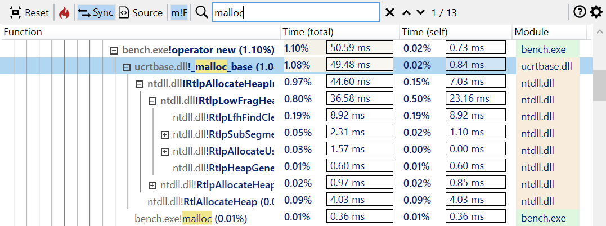

#### Overview

The Call Tree view displays the tree derived from combining the call stacks associated with all profile samples in the trace, with each node representing a unique instance of a function. The node's children represent the callees (called functions), and the parent is the caller function.  

*Total (inclusive) execution time* is computed by accumulating the time of all samples with the instance in the call stack.  
*Self (exclusive) execution time* is computed by subtracting the time spent in children nodes from the total execution time.

[{: style="width:700px"}](img/call-tree-view_1081x540.png){:target="_blank"}

The view has two parts:  

- a toolbar at the top, with action buttons and the *Search* input box.
- the tree list view displaying the call tree.  
  
A function node has the demangled (undecorated) function name, optionally prepended with the module name, the total execution time percentage (relative to the entire trace),  followed by total/self execution time and module columns.

???+ note
    By default, several levels of the call path with the longest execution time is expanded. This can be configured in the *Call Tree options* panel.  

    The columns in all list views can be resized and reorder. The new layout is saved across sessions when closing the application.

#### Searching functions

Use the *search input box* in the toolbar to search for functions with a specific name using a case-insensitive substring search. Matching nodes and function names are marked, and the *up/down* buttons on the right can be used to navigate between results. Press the *Escape* key to reset the search or the X button next to the input box.

[{: style="width:700px"}](img/call-tree-search_1077x402.png){:target="_blank"}

#### View interaction

???+ abstract "Toolbar"
    | Button | Description |
    | ------ | ------------|
    |  | Resets the view to the initial state. |
    |  | Expands several levels of the the slowest path in the call tree. |
    |  | If enabled, selecting a node also selects the associated function in the other profiling views. |
    |  | If enabled, selecting a node also displays the associated function in the *Source File* view, with the source lines annotated with profiling data. |
    |  | If enabled, display the module name before the function name in the nodes as module!function. |
    | Search box | Search for nodes with a specific function name using a case-insensitive substring search. Press the *Escape* key to reset the search or the *X* button next to the input box. |

???+ abstract "Mouse shortcuts"
    | Action | Description |
    | ------ | ------------|
    | Hover |  Hovering over a node briefly displays a preview popup with the complete function name and total/self execution times. *Clicking* the *Pin button* or dragging the popup expands it into a panel equivalent to the *Details panel*. Multiple such panels can be kept open at the same time. |
    | Click | Selects a function. If *Sync* is enabled in the toolbar, the function is also selected in the other panels. Displays the associated function in the *Source File* view if *Source* is enabled in the toolbar. |
    | Double-click | Opens the *Assembly* view of the selected function in the active tab. |
    | Ctrl+Double-click | Opens the *Assembly* view of the selected function in a new tab. |
    | Shift+Double-click | Opens the *Assembly* view of the selected function in the active tab, with profile data filtered to include only the selected instance. |
    | Ctrl+Shift+Double-click | Opens the *Assembly* view of the selected function in a new tab, with profile data filtered to include only the selected instance. |
    | Right-click | Shows the context menu for the selected function. |

???+ abstract "Keyboard shortcuts"
    | Keys | Description |
    | ------ | ------------|
    | Space | Expands (zooms-in) the pointed node to cover the view's width, adjusting child node widths accordingly. |
    | Return | Opens the *Assembly* view of the selected function in the active tab. |
    | Ctrl+Return | Opens the *Assembly* view of the selected function in a new tab. |
    | Alt+Return | Opens a preview popup with the assembly of the selected function. Press the *Escape* key to close the popup.  Multiple preview popups can be can be kept open at the same time. |
    | Shift+Return | Opens the *Assembly* view of the selected function in the active tab, with profile data filtered to include only the selected instance. |
    | Ctrl+Shift+Return | Opens the *Assembly* view of the selected function in a new tab, with profile data filtered to include only the selected instance. |
    | Alt+Shift+Return | Opens a preview popup with the assembly of the selected function, with profile data filtered to include only the selected instance. |
    | Ctrl+C | Copies to clipboard a HTML and Markdown table with a summary of the selected nodes. |
    | Ctrl+Shift+C | Copies to clipboard the function names of the selected nodes. |
    | Ctrl+Alt+C | Copies to clipboard the mangled/decorated function names of the selected nodes. |
    | Ctrl+= | Expands several levels of the the slowest path of children of the selected function. |
    | Ctrl+- | Collapses all children of the selected function. |
    | Ctrl+0 Ctrl+R |  Resets the view to the initial state. |
    | Left-arrow key | Collapses the children of the selected function and goes up one level. |
    | Right-arrow key | Expands the children of the selected function and goes down one level. |
    
???+ abstract "Right-click context menu"
    [{: style="width:380px"}](img/call-tree-context-menu_524x517.png){:target="_blank"}  

#### View options

*Click* on the *Gears* icon in the top-right part of the view displays the options panel (alternatively, use the *Call Tree* tab in the application *Settings* window.).  

The tabs below describe each page of the options panel:  
=== "General"
    [{: style="width:400px"}](img/call-options-general_584x282.png){:target="_blank"} 

#### Documentation in progress
- Marking nodes
- View options