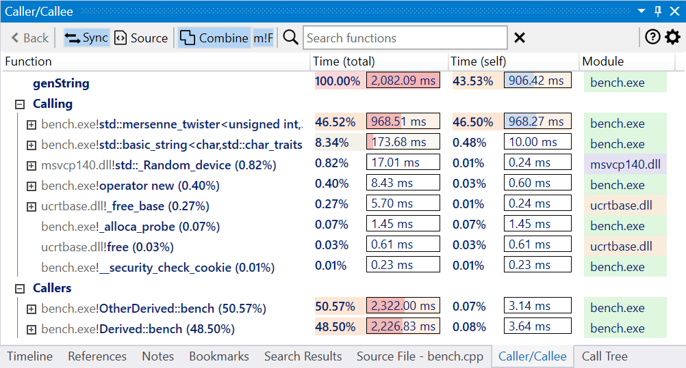
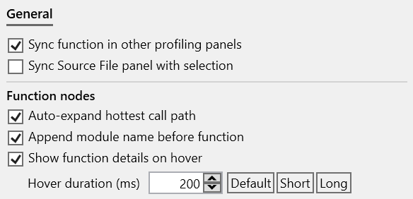

#### Overview

The Caller/Callee view displays the active function's list of callers and callees (function being called by it). It can be viewed as an extension of the [Call Tree view](call-tree-panel.md) focused on a single function.     

[{: style="width:700px"}](img/caller-view_1002x539.png){:target="_blank"}

The view has four parts:  

- a toolbar at the top, with action buttons and the *Search* input box.
- a function node representing the active function, with a 100% total execution time.
- the *Calling* tree list view displaying the callee functions.
- the *Callers* tree list view displaying the caller functions.
  
A function node has the demangled (undecorated) function name, optionally prepended with the module name, the total execution time percentage (relative to the entire trace),  followed by total/self execution time and module columns.

???+ note
    The columns in all list views can be resized and reorder. The new layout is saved across sessions when closing the application.

By default, all function instances are displayed combined, with the lists of callers and callees merged and execution time summed up. To display individual instances instead, disable *Combine* in the toolbar.

[{: style="width:700px"}](img/call-tree-instances_1005x311.png){:target="_blank"}

Expanding a caller function form the list goes up the call tree, showing a list of callers which forms a stack trace leading to the entry function. This makes it easy to see the call path that leads to a caller.

[{: style="width:500px"}](img/caller-expand-caller_804x233.png){:target="_blank"}

Expanding a callee function from the list goes down the call tree, showing a list of callees until a leaf node is reached. This makes it easy to see which functions are being called starting with a callee.

[{: style="width:500px"}](img/caller-expand-calling_724x210.png){:target="_blank"}

#### View interaction

???+ abstract "Toolbar"
    | Button | Description |
    | ------ | ------------|
    |  | Navigates back to the previous viewed function in the view. |
    |  | If enabled, selecting a node also selects the associated function in the other profiling views. |
    |  | If enabled, selecting a node also displays the associated function in the Source file view, with the source lines annotated with profiling data. |
    |  | If enabled, all function instances are displayed combined, with the lists of callers and callees merged and execution time summed up. |
    |  | If enabled, display the module name before the function name in the nodes as module!function. |
    | Search box | Search for nodes with a specific function name using a case-insensitive substring search. Press the *Escape* key to reset the search or the *X* button next to the input box. |

???+ abstract "Mouse shortcuts"
    | Action | Description |
    | ------ | ------------|
    | Hover |  Hovering over a node briefly displays a preview popup with the complete function name and total/self execution times, similar to the Flame Graph view. |
    | Click | Selects the function. If *Sync* is enabled in the toolbar, the function is selected in the other panels. Displays the associated function in the Source file view if *Source* is enabled in the toolbar. |
    | Double-click | Switches the view to display the selected function instead. |
    | Ctrl+Double-click | Opens the Assembly view of the selected function in the active tab. |
    | Ctrl+Shift+Double-click | Opens the Assembly view of the selected function in a new tab. |
    | Right-click | Shows the context menu for the selected function. |
    | Back | If the mouse has an optional *Back* button, navigates back to the previous viewed function in the view. |

???+ abstract "Keyboard shortcuts"
    | Keys | Description |
    | ------ | ------------|
    | Return | Switches the view to display the selected function instead. |
    | Ctrl+Return | Opens the Assembly view of the selected function in the active tab. |
    | Ctrl+Shift+Return | Opens the Assembly view of the selected function in a new tab. |
    | Alt+Return | Opens a preview popup with the assembly of the selected function. Press the *Escape* key to close the popup.  Multiple preview popups can be can be kept open at the same time. |
    | Alt+Shift+Return | Opens a preview popup with the assembly of the selected function, with profile data filtered to include only the selected instance. |
    | Ctrl+C | Copies to clipboard a HTML and Markdown table with a summary of the selected nodes. |
    | Ctrl+Shift+C | Copies to clipboard the function names of the selected nodes. |
    | Ctrl+Alt+C | Copies to clipboard the mangled/decorated function names of the selected nodes. |
    | Backspace | navigates back to the previous viewed function in the view. |
    | Ctrl+= | Expands several levels of the the slowest path of children of the selected function. |
    | Ctrl+- | Collapses all children of the selected function. |
    | Ctrl+0 Ctrl+R |  Resets the view to the initial state. |
    | Left-arrow key | Collapses the children of the selected function and goes up one level. |
    | Right-arrow key | Expands the children of the selected function and goes down one level. |
    
???+ abstract "Right-click context menu"
    [{: style="width:380px"}](img/call-tree-context-menu_524x517.png){:target="_blank"}  

#### View options

*Click* on the *Gears* icon in the top-right part of the view displays the options panel (alternatively, use the *Caller/Callee* tab in the application *Settings* window.).  

The tabs below describe each page of the options panel:  
=== "General"
    [{: style="width:400px"}](img/call-options-general_584x282.png){:target="_blank"} 

#### Documentation in progress
- Marking nodes
- View options